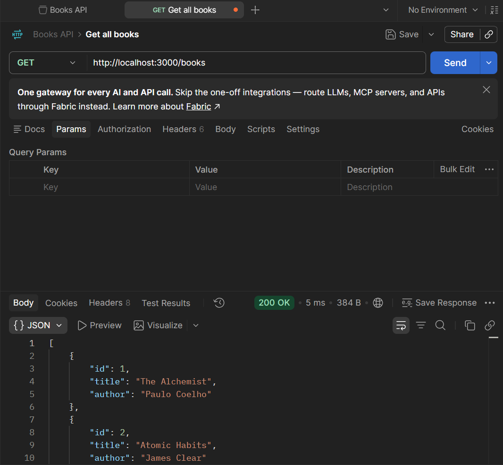
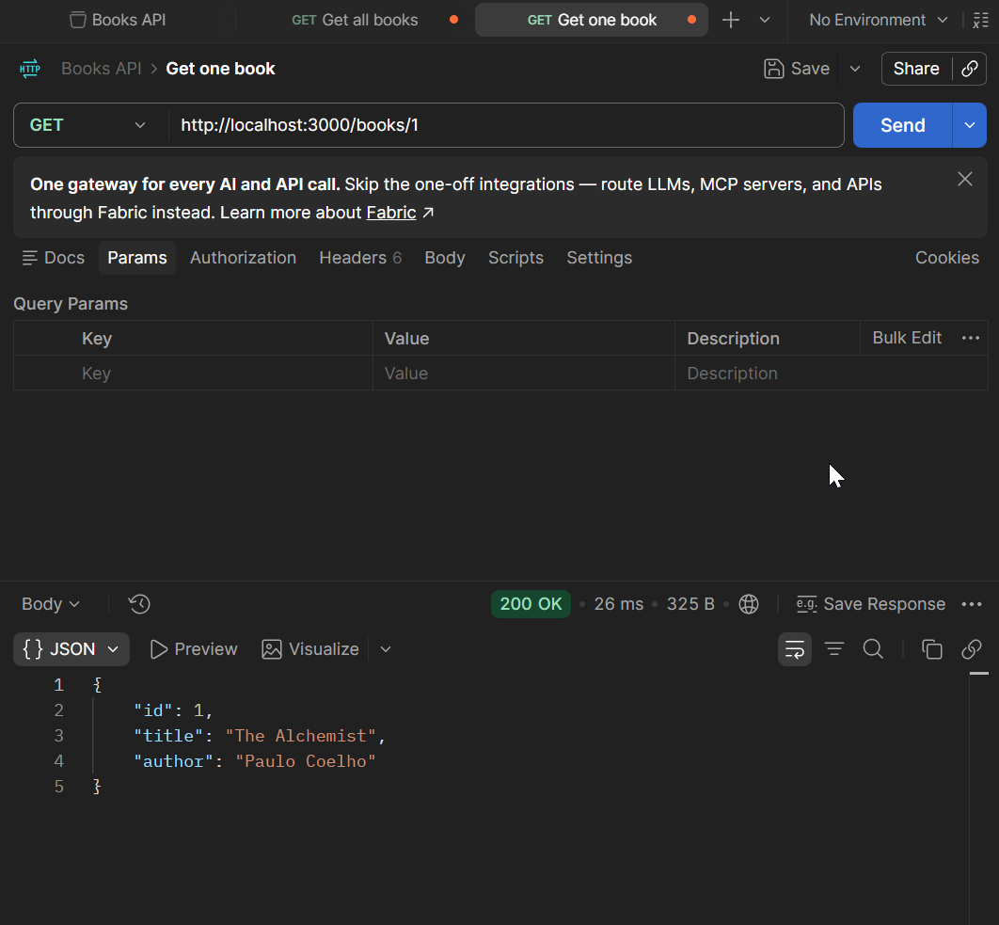
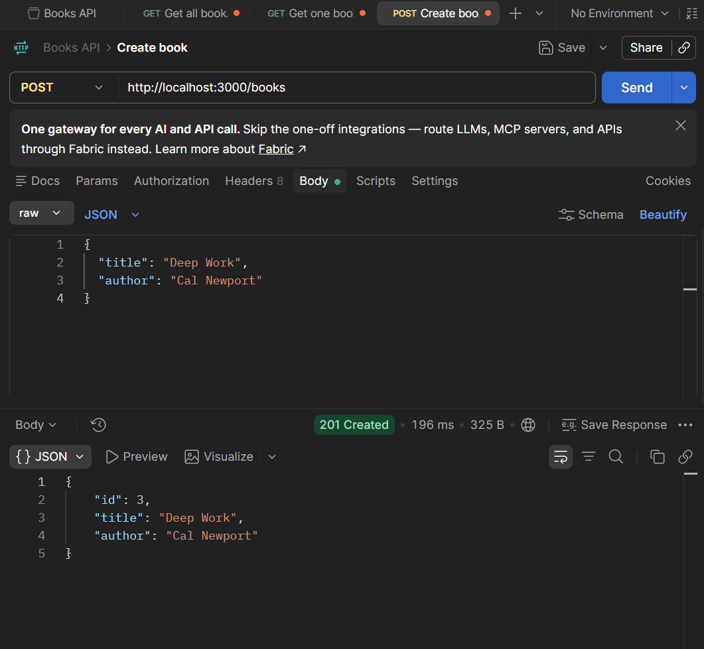
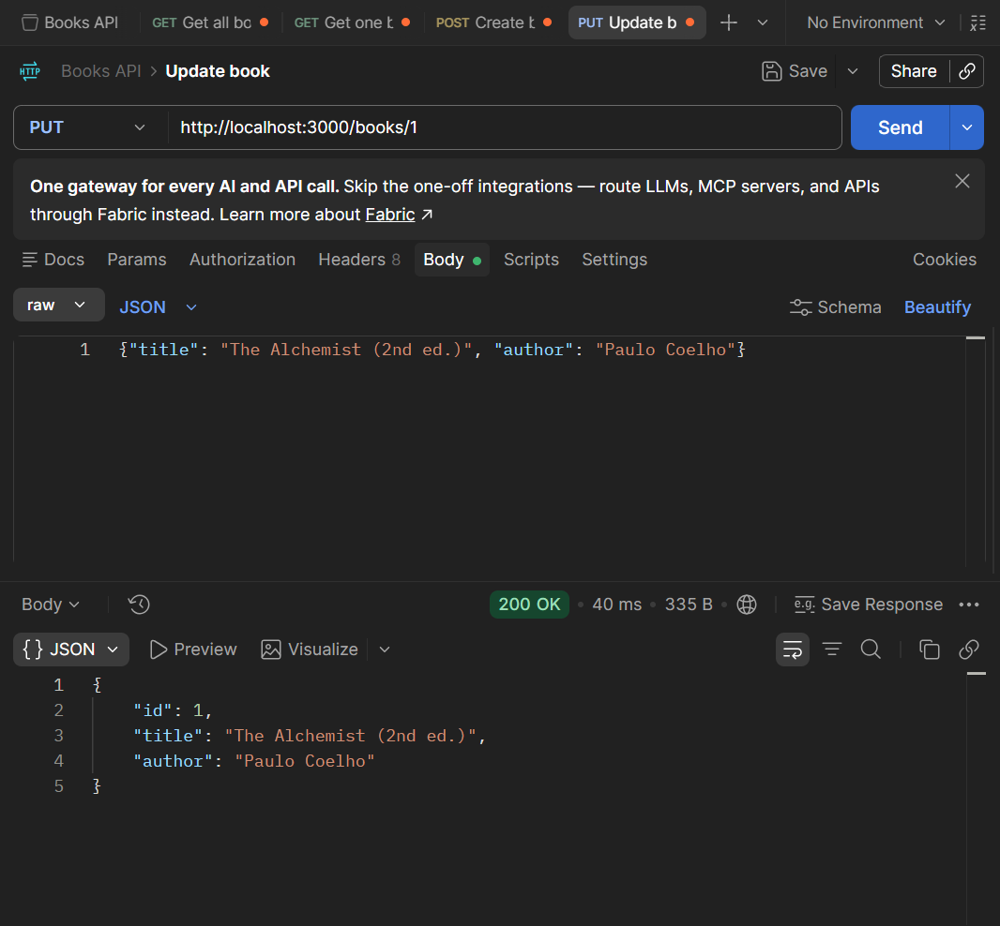
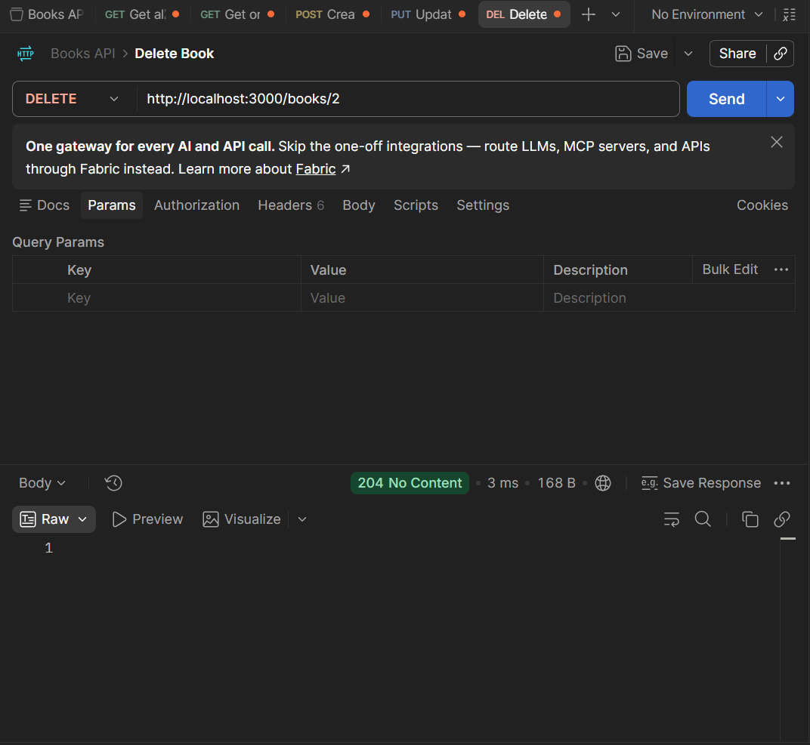
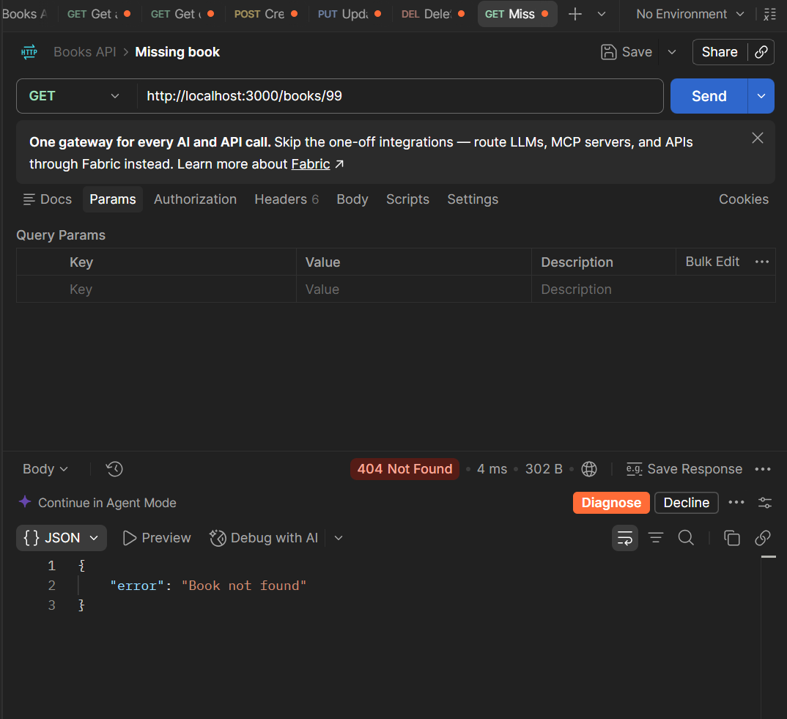
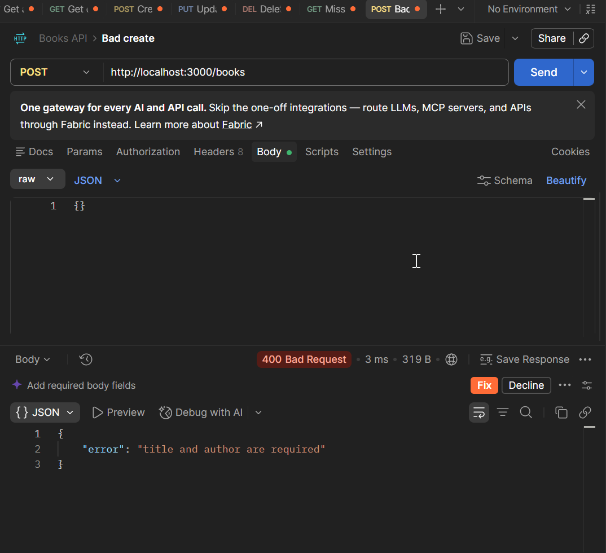

# Books REST API

A simple REST API for managing books, built with Node.js and Express. It includes a small frontend to add, edit and delete books from the browser.

**Live demo:** `https://your-app.onrender.com` <!-- replace with your Render URL -->


## Features

- Full CRUD for books (create, read, update, delete)
- Input validation with clear error messages
- Proper HTTP status codes (200, 201, 204, 400, 404, 500)
- Custom error-handling middleware
- CORS enabled
- Simple frontend served from the same server

## Tech stack

Node.js, Express, CORS, HTML/CSS/JavaScript, Postman for testing.

## Getting started

```bash
git clone https://github.com/YOUR_USERNAME/books-api.git
cd books-api
npm install
npm start
```

Open `http://localhost:3000` in your browser.

## API endpoints

| Method | Endpoint | Description | Success |
|---|---|---|---|
| GET | `/books` | Get all books | 200 |
| GET | `/books/:id` | Get one book | 200 |
| POST | `/books` | Create a book | 201 |
| PUT | `/books/:id` | Update a book | 200 |
| DELETE | `/books/:id` | Delete a book | 204 |

Request body for POST and PUT:

```json
{
  "title": "Dune",
  "author": "Frank Herbert"
}
```

Error responses look like this:

```json
{ "error": "Book not found" }
```

## Testing with Postman

All endpoints were tested in Postman.

**GET all books**



**GET one book**



**POST create a book**



**PUT update a book**



**DELETE a book**



**Error cases (404 and 400)**




## Project structure

```
books-api/
├── server.js        # Express server and API routes
├── package.json
├── public/
│   └── index.html   # Frontend
└── screenshots/     # Postman and frontend screenshots
```

## Note

Data is stored in memory, so it resets when the server restarts.
